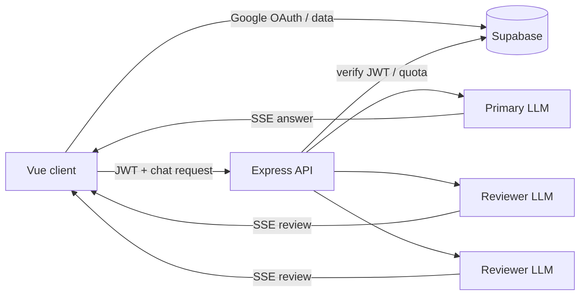

# ThreeBody

[](https://threebody-phi.vercel.app)
[](https://vuejs.org/)
[](https://www.typescriptlang.org/)
[](https://supabase.com/)
[](https://github.com/tkt0605/threebody/commits/main)
[](https://github.com/tkt0605/threebody/stargazers)

[日本語](README.md) · **English**

ThreeBody is a voice-first chat application where one AI answers first and up to two other AIs review that answer afterward. Claude, GPT, DeepSeek, and a local Ollama instance can be freely combined as independent “bodies.”


## Live demo

**https://threebody-phi.vercel.app**

Sign in with Google to use the app. For continued use of cloud models, open Advanced Settings and enter an API key and model name for each provider.

> [!NOTE]
> The hosted backend cannot reach an Ollama instance running on a visitor's computer. Run this repository locally to use Ollama.

## How ThreeBody works

ThreeBody does not combine several model outputs before producing one answer.

1. The **primary body** streams an answer under the same conditions as a normal single-model chat.
2. When the answer is long enough and the question benefits from review, the **secondary bodies** read it in parallel.
3. Each secondary body returns one finding from its assigned perspective: “Weak point,” “Missing consideration,” or “Alternative view.”
4. A review card is hidden when there is no finding. A secondary-body failure never changes the primary answer that has already arrived.

When only one body is active, ThreeBody behaves as a standard single-model chat. It skips unnecessary review for short greetings and very short answers.

## Features

- Voice and text input, with adaptive end-of-speech detection and automatic sending
- Sentence-by-sentence streaming narration and voice barge-in
- Wake-word input with “Iris”
- Up to three independently configured providers/models and three UI thinking levels
- Japanese or English responses, voice style, and extra system instructions
- Google sign-in through Supabase Auth
- Persistent conversations with resume, rename, and delete actions
- Per-conversation “body notes” for goals, decisions, and hypotheses, with Markdown import/export
- Revocable public links for individual reviewed turns
- Markdown rendering, syntax highlighting, and code copying
- Generation cancellation, edit/resend for failed questions, error reports, and account deletion
- Light/dark themes and screen-reader live announcements

## Supported providers

| Provider | API key | Model name | Notes |
|---|---:|---:|---|
| Anthropic (Claude) | Required | Required | Native SDK |
| OpenAI (GPT) | Required | Required | Chat Completions API |
| DeepSeek | Required | Required | OpenAI-compatible API |
| Ollama | Not required | Optional | Intended for local use; blank selects the server default |

Cloud API keys and model names are entered per body in the browser settings. A cloud body without both values is disabled, and the response uses only the remaining active bodies.

## Free trial quota

When the operator's shared Anthropic key is enabled, signed-in users without their own cloud API key can try three-body mode up to **3 times per day**. The thinking level is fixed at 2, and the entire service has a separate limit of **50 successful turns per JST day**. Usage is counted only after a response completes successfully.

The trial is unavailable when the shared key is not configured, the account has been disabled, or either limit has been reached. When running Ollama locally, turn off “Free trial quota” in Settings to route directly to Ollama.

## Tech stack

| Layer | Technology |
|---|---|
| Frontend | Vue 3, TypeScript, Vite, Vue Router, Tailwind CSS 4 |
| Backend | Express 5, TypeScript, Server-Sent Events (SSE) |
| Auth and data | Supabase Auth, Postgres, Row Level Security |
| LLMs | Anthropic SDK, OpenAI SDK, DeepSeek-compatible API, Ollama native API |
| Rendering | marked, DOMPurify, Shiki |
| Tests | Vitest, jsdom |
| Hosting | Vercel (frontend), Render (API) |

## Architecture



The frontend stores authenticated users' conversations directly in Supabase and sends LLM calls and server-privileged operations such as account deletion to the Express API. The API verifies the JWT and streams both the primary answer and secondary reviews over SSE. Only the latest 10 messages are sent back to a model as conversation history.

Public links never expose the underlying conversation tables. Anonymous visitors read only a dedicated `published_turns` snapshot. Opening a shared link does not call an LLM or consume trial quota.

## Local development

### Prerequisites

- Node.js `^20.19.0 || ^22.12.0 || >=24.0.0` and npm
- A Supabase project with Google OAuth enabled
- At least one model route:
  - an Anthropic, OpenAI, or DeepSeek API key plus a model name;
  - a running local Ollama instance with a pulled model; or
  - an operator-provided shared Anthropic key.

### 1. Install

```bash
git clone https://github.com/tkt0605/threebody.git
cd threebody
npm install
cp .env.example .env
```

### 2. Prepare Supabase

1. Create a Supabase project.
2. Run [`docs/schema.sql`](docs/schema.sql) from top to bottom in the SQL Editor.
3. Enable Google under Authentication providers.
4. Add `http://localhost:5174` as the local Site URL and `http://localhost:5174/auth/callback` as an allowed Redirect URL.
5. Copy the project URL, publishable key, and secret key from Project Settings.

`SUPABASE_SECRET_KEY` is used to verify user JWTs, manage shared quota, and delete accounts. Normal chat is authenticated as well, so configure it even for local development.

### 3. Configure environment variables

At minimum, fill in these values in `.env`:

```dotenv
VITE_API_BASE_URL=http://localhost:3000
VITE_ORIGIN_BASE_URL=http://localhost:5174

VITE_SUPABASE_URL=https://YOUR_PROJECT.supabase.co
VITE_SUPABASE_PUBLISHABLE_KEY=sb_publishable_...
SUPABASE_SECRET_KEY=sb_secret_...
```

To use Ollama, pull a model first and enable the local route:

```bash
ollama pull qwen2.5:7b
```

```dotenv
OLLAMA_ENABLED=true
OLLAMA_BASE_URL=http://localhost:11434
OLLAMA_MODEL_DEFAULT=qwen2.5:7b
```

To operate the free trial, configure `SHARED_ANTHROPIC_API_KEY` and at least `ANTHROPIC_MODEL_FAST`. BYOK model names are selected per body in the application settings. See [`.env.example`](.env.example) for every variable and its constraints.

> [!IMPORTANT]
> Values prefixed with `VITE_` are exposed to the browser. Never add that prefix to `SUPABASE_SECRET_KEY`, `SHARED_ANTHROPIC_API_KEY`, or any private LLM key.

### 4. Start the app

```bash
npm run dev:all
```

- Frontend: http://localhost:5174
- API: http://localhost:3000
- Health check: http://localhost:3000/api/health

Use `npm run dev` and `npm run dev:server` to start the frontend and API separately.

## Configuration and data handling

- BYOK API keys are not stored in Supabase. The browser stores AES-GCM ciphertext in `localStorage` and a non-exportable encryption key in IndexedDB, then sends the decrypted value to the API only for an LLM request.
- Known secret values are redacted by the backend in provider errors and by the frontend in error reports.
- Conversations, messages, content blocks, and feedback are protected by Supabase RLS ownership policies.
- Sharing is private by default. Only an explicitly published turn is copied into an anonymous snapshot, and a revoked URL can no longer read it.
- `SUPABASE_SECRET_KEY` bypasses RLS and must remain in a server-only environment.

Browser-side encryption prevents plain-text storage on disk; it is not a boundary that can isolate a key from all same-origin JavaScript while the application is running.

## Voice compatibility

Voice input and wake-word detection use the browser's Web Speech API, while narration uses the Speech Synthesis API. Availability and recognition quality depend on the browser and operating system. Text input remains available when speech recognition is unsupported or microphone permission is denied. Serve production deployments over HTTPS for microphone access (`localhost` is the development exception).

## Commands

| Command | Purpose |
|---|---|
| `npm run dev:all` | Start Vite and Express together |
| `npm run dev` | Start the frontend only |
| `npm run dev:server` | Start the API in watch mode |
| `npm start` | Start the API |
| `npx vite build` | Build the production frontend into `dist/` |
| `npm run preview` | Preview the built frontend |
| `npm run typecheck` | Type-check the frontend |
| `npm run typecheck:backend` | Type-check the backend |
| `npm run lint` | Run ESLint |
| `npm test` | Run Vitest once |
| `npm run verify:supabase-rotation` | Confirm retired Supabase keys are rejected |
| `npm run verify:anon-columns` | Verify columns exposed to anonymous clients |
| `npm run verify:share` | Verify sharing RLS and public snapshots |

There is no `npm run build` script in this project. Use `npx vite build` for the frontend production build.

## Project structure

```text
src/
  components/            UI components
  composables/           Shared state, chat, voice, and auth behavior
  lib/                   Pure helpers and the Supabase client
  views/                 Route-level views
backend/
  llm/providers/         Provider streaming implementations
  routes/                chat, capabilities, health, and account routes
  utils/                 Server-side helpers
docs/
  schema.sql             Canonical Supabase schema
scripts/                 Regression, measurement, and security checks
```

Shared reactive frontend state follows the module-level singleton pattern in `src/composables/`.

## Testing and quality checks

Run the standard verification set before submitting a change:

```bash
npm test
npm run typecheck
npm run typecheck:backend
npm run lint
npx vite build
```

To run focused tests:

```bash
npx vitest run src/composables/__tests__/useChat.test.ts
npx vitest run backend/tests/chatRoute.test.ts
```

## Deployment

The current production layout deploys the Vite frontend to Vercel and the Express API to Render.

- On Vercel, use `npx vite build` with `dist` as the output directory. [`vercel.json`](vercel.json) already defines the SPA fallback.
- Use [`render.yaml`](render.yaml) as the source of truth for the Render service. `/api/health` is its health check.
- Set production `VITE_API_BASE_URL` to the Render API URL, and set Render's `VITE_ORIGIN_BASE_URL` to the Vercel frontend origin.
- Set `OLLAMA_ENABLED=false` because Render cannot reach a visitor's local Ollama instance.
- Add the production site and callback URLs to the Supabase Auth URL configuration.

Installing the Vercel CLI is strongly recommended for pulling environment variables, deploying, and inspecting logs from the command line:

```bash
npm i -g vercel
```

## API

| Method | Path | Purpose |
|---|---|---|
| `POST` | `/api/chat` | Requires a JWT; streams answers and reviews over SSE |
| `GET` | `/api/capabilities` | Returns shared-key quota and Ollama availability |
| `GET` | `/api/health` | Reports API and key configuration health |
| `DELETE` | `/api/account` | Requires a JWT; deletes the account and associated data |

`POST /api/chat` is rate-limited to 15 requests per 5 minutes per IP address.
