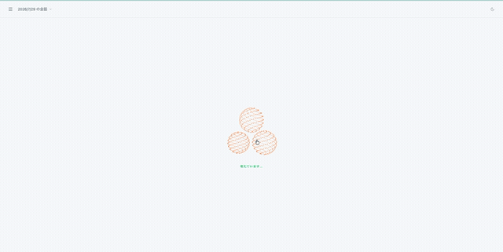

# Three Body
> 3つのモデルが並列で考え、球体がその思考を可視化する。 
> LLM APIまたは、OllamaのローカルLLMのモデルを自由に組み合わせられる。
> 声で話しかけ、声で会話が完結する。



# 今すぐ試す
https://threebody-phi.vercel.app

Google認証でログイン後、設定画面でLLM APIキーを入力すればすぐに使える。

## LLM APIキーの取得方法
1. OpenAPI, Anthropic, Google各社のAPIコンソールにアクセス
2. 各自のアカウントを作成・ログイン
3. **Create API key** をクリック
4. このアプリの`設定ボタン`の詳細設定から取得したAPI Keyと利用するLLMモデルを貼り付ける。

## これはどんなものか？ 
従来のものは、モデルもUIも固定である。
しかし、Threebodyは違う。Ollama・chatCPT・Claude・Gemini・Deepseekを
自由に組み合わせ、３つの視点から物事を推論させ、答えを導く。
## 　クイック・スタート
以下は、Githubからのディレクトリをクローンしてから依存関係をインストール。
```bash
git clone https://github.com/tkt0605/threebody
cd threebody
npm install
npm run dev:all
```