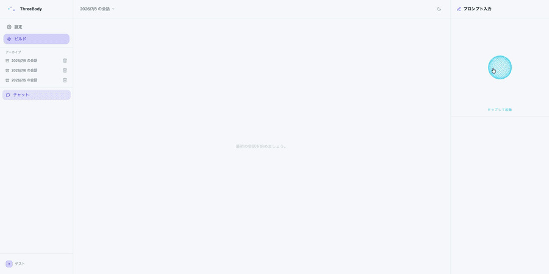

# Three Body
> 3つのモデルが並列で考え、球体がその思考を可視化する。 
> LLM APIまたは、OllamaのローカルLLMのモデルを自由に組み合わせられる。
> 声で話しかけ、声で会話が完結する。



## これはどんなものか？ 
従来のものは、モデルもUIも固定である。
しかし、Threebodyは違う。Ollama・chatCPT・Claude・Gemini・Deepseekを
自由に組み合わせ、３つの視点から物事を推論させ、答えを導く。
## 　クイック・スタート

```bash

git clone https://github.com/tkt0605/threebody
cd threebody
npm install
npm run dev:all

```