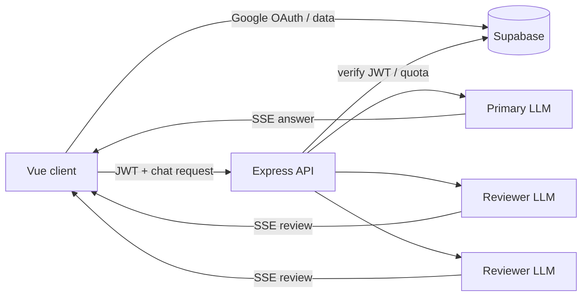

# ThreeBody

[](https://threebody-phi.vercel.app)
[](https://vuejs.org/)
[](https://www.typescriptlang.org/)
[](https://supabase.com/)
[](https://github.com/tkt0605/threebody/commits/main)
[](https://github.com/tkt0605/threebody/stargazers)

**日本語** · [English](README.en.md)

1つのAIがまず答え、最大2つの別のAIがその答えをあとから検算する、音声ファーストのチャットアプリです。Claude、GPT、DeepSeek、ローカルのOllamaを「体」として自由に組み合わせられます。


## デモ

**https://threebody-phi.vercel.app**

Googleアカウントでログインすると利用できます。クラウドモデルを継続利用する場合は、設定画面の「詳細設定」から各プロバイダーのAPIキーとモデル名を登録してください。

> [!NOTE]
> ホスト版のバックエンドから、利用者のPC上で動くOllamaへは接続できません。Ollamaを使う場合はこのリポジトリをローカルで実行してください。

## ThreeBodyの仕組み

ThreeBodyは、複数モデルの出力を先に混ぜて1つの答えを作る方式ではありません。

1. **主体（一体目）**が、通常の単体チャットと同じ条件で回答をストリーミングします。
2. 回答が一定の長さを持ち、検算が有効な問いであれば、**副体（二・三体目）**が回答を並列に読みます。
3. 副体はそれぞれ「崩れる点」「抜けている点」「別の見方」のうち割り当てられた観点から、指摘を1つだけ返します。
4. 指摘がなければカードは表示されません。副体が失敗しても、すでに届いた主体の回答には影響しません。

有効な体が1つだけなら通常の単体モードとして動作します。短い挨拶や短文回答では不要な検算を省略します。

## 主な機能

- 音声入力とテキスト入力。音声は発話の区切りを見て自動送信
- 回答の文単位ストリーミング読み上げと、発話による割り込み（バージイン）
<!-- - 「アイリス」の呼びかけによるウェイクワード入力 -->
- 最大3体のプロバイダー・モデル構成と、3段階の思考レベル
- 日本語・英語、話し方、追加システム指示の設定
- Supabase AuthによるGoogleログイン
- 会話履歴の保存、再開、名前変更、削除
- 会話ごとの目的・決定・仮説を整理する「bodyノート」とMarkdown入出力
- 検算付きの1ターンだけを公開できる、取り消し可能な共有リンク
- Markdown、コードハイライト、コードコピー
- 生成停止、失敗した質問の編集・再送、エラー報告、アカウント削除
- ライト／ダークテーマとスクリーンリーダー向けライブ通知

## 対応プロバイダー

| プロバイダー | APIキー | モデル名 | 備考 |
|---|---:|---:|---|
| Anthropic（Claude） | 必要 | 必要 | ネイティブSDKで接続 |
| OpenAI（GPT） | 必要 | 必要 | Chat Completionsで接続 |
| DeepSeek | 必要 | 必要 | OpenAI互換APIで接続 |
| Ollama | 不要 | 任意 | ローカル向け。空欄時はサーバーの既定モデルを使用 |

クラウドモデルのAPIキーとモデル名は、各体ごとにブラウザの設定画面へ入力します。APIキーが未設定のクラウド体は無効になり、残った有効な体だけで応答します。

## 無料お試し枠

運営側で共有Anthropicキーが有効な場合、自分のクラウドAPIキーを持たないログインユーザーは三体モードを**1日3回**まで試せます。思考レベルは2に固定され、サービス全体でもJST基準で**1日50回**が上限です。応答が正常完了した場合だけ利用回数へ加算されます。

共有キーが未設定、停止中、または上限到達の場合は利用できません。ローカル実行でOllamaを使うときは、設定画面の「無料お試し枠」をオフにするとOllamaへ直接切り替わります。

## 技術スタック

| レイヤー | 技術 |
|---|---|
| フロントエンド | Vue 3、TypeScript、Vite、Vue Router、Tailwind CSS 4 |
| バックエンド | Express 5、TypeScript、Server-Sent Events（SSE） |
| 認証・データ | Supabase Auth、Postgres、Row Level Security |
| LLM | Anthropic SDK、OpenAI SDK、DeepSeek互換API、Ollama native API |
| 表示 | marked、DOMPurify、Shiki |
| テスト | Vitest、jsdom |
| ホスティング | Vercel（フロントエンド）、Render（API） |

## アーキテクチャ



フロントエンドは認証済みユーザーの会話をSupabaseへ直接保存し、LLM呼び出しやアカウント削除などサーバー権限が必要な処理をExpress APIへ送ります。APIはJWTを検証し、主体の回答と副体の検算をSSEで配信します。会話履歴としてモデルへ再送するのは直近10メッセージです。

共有リンクは会話本体を公開せず、公開専用の`published_turns`スナップショットだけを匿名で読み取ります。リンクの閲覧ではLLMを呼ばないため、無料枠を消費しません。

## ローカル開発

### 必要なもの

- Node.js `^20.19.0 || ^22.12.0 || >=24.0.0` とnpm
- Google OAuthを有効にしたSupabaseプロジェクト
- 少なくとも1つの利用経路
  - Anthropic、OpenAI、DeepSeekのAPIキーとモデル名
  - または、ローカルで起動したOllamaとpull済みモデル
  - または、運営用の共有Anthropicキー

### 1. インストール

```bash
git clone https://github.com/tkt0605/threebody.git
cd threebody
npm install
cp .env.example .env
```

### 2. Supabaseを準備する

1. Supabaseでプロジェクトを作成します。
2. SQL Editorで[`docs/schema.sql`](docs/schema.sql)を上から順に適用します。
3. AuthenticationのProvidersでGoogleを有効にします。
4. URL ConfigurationにローカルのSite URL `http://localhost:5174` とRedirect URL `http://localhost:5174/auth/callback`を登録します。
5. Project SettingsのURL、publishable key、secret keyを控えます。

`SUPABASE_SECRET_KEY`はユーザーJWTの検証、共有枠、アカウント削除に使います。通常のチャットも認証必須なので、ローカル利用でも設定してください。

### 3. 環境変数を設定する

最低限、`.env`の次の値を埋めます。

```dotenv
VITE_API_BASE_URL=http://localhost:3000
VITE_ORIGIN_BASE_URL=http://localhost:5174

VITE_SUPABASE_URL=https://YOUR_PROJECT.supabase.co
VITE_SUPABASE_PUBLISHABLE_KEY=sb_publishable_...
SUPABASE_SECRET_KEY=sb_secret_...
```

Ollamaを使う場合は、事前にモデルをpullしてから次を設定します。

```bash
ollama pull qwen2.5:7b
```

```dotenv
OLLAMA_ENABLED=true
OLLAMA_BASE_URL=http://localhost:11434
OLLAMA_MODEL_DEFAULT=qwen2.5:7b
```

共有のお試し枠を運用する場合は、`SHARED_ANTHROPIC_API_KEY`と少なくとも`ANTHROPIC_MODEL_FAST`を設定します。BYOKで使う各体のモデル名はアプリの設定画面で指定します。全変数と注意点は[`.env.example`](.env.example)を参照してください。

> [!IMPORTANT]
> `VITE_`で始まる値はブラウザへ公開されます。`SUPABASE_SECRET_KEY`、`SHARED_ANTHROPIC_API_KEY`、各LLMの秘密鍵には絶対に`VITE_`を付けないでください。

### 4. 起動する

```bash
npm run dev:all
```

- フロントエンド: http://localhost:5174
- API: http://localhost:3000
- ヘルスチェック: http://localhost:3000/api/health

フロントエンドとAPIを別々に起動する場合は、`npm run dev`と`npm run dev:server`を使います。

## 設定とデータの扱い

- BYOKのAPIキーはSupabaseへ保存しません。ブラウザ内でAES-GCM暗号化した暗号文を`localStorage`へ、非exportableな暗号鍵をIndexedDBへ保存し、LLM呼び出し時だけAPIへ送ります。
- 既知の秘密値は、プロバイダーエラーではバックエンド、エラー報告ではフロントエンドが伏せ字化します。
- 会話、メッセージ、本文ブロック、フィードバックはSupabase RLSで所有者に制限されます。
- 共有は初期状態で非公開です。公開した1ターンだけが匿名閲覧用スナップショットになり、取り消し後は同じURLで読めなくなります。
- `SUPABASE_SECRET_KEY`はRLSを迂回できるため、サーバー環境だけで管理してください。

ブラウザ内の暗号化は、端末上での平文保存を避けるためのものです。実行中の同一オリジンのJavaScriptからキーを完全に隔離する仕組みではありません。

## 音声機能の互換性

音声入力とウェイクワードはブラウザのWeb Speech API、読み上げはSpeech Synthesis APIを使います。利用可否や認識品質はブラウザとOSに依存します。音声認識に非対応の環境やマイク権限を許可しない場合も、テキスト入力はそのまま利用できます。本番ではマイク利用のためHTTPSで配信してください（`localhost`は開発用途の例外です）。

## コマンド

| コマンド | 内容 |
|---|---|
| `npm run dev:all` | ViteとExpressを同時起動 |
| `npm run dev` | フロントエンドのみ起動 |
| `npm run dev:server` | APIをwatchモードで起動 |
| `npm start` | APIを起動 |
| `npx vite build` | 本番用フロントエンドを`dist/`へビルド |
| `npm run preview` | ビルド済みフロントエンドをプレビュー |
| `npm run typecheck` | フロントエンドの型チェック |
| `npm run typecheck:backend` | バックエンドの型チェック |
| `npm run lint` | ESLint |
| `npm test` | Vitestを1回実行 |
| `npm run verify:supabase-rotation` | 旧Supabaseキーの無効化を確認 |
| `npm run verify:anon-columns` | 匿名アクセス可能な列を検証 |
| `npm run verify:share` | 共有用RLSと公開スナップショットを検証 |

このプロジェクトには`npm run build`スクリプトはありません。フロントエンドのビルドには`npx vite build`を使います。

## ディレクトリ構成

```text
src/
  components/            UIコンポーネント
  composables/           共有状態、チャット、音声、認証
  lib/                   純粋なヘルパーとSupabaseクライアント
  views/                 ルート画面
backend/
  llm/providers/         各LLMのストリーミング実装
  routes/                chat、capabilities、health、account
  utils/                 サーバー用ヘルパー
docs/
  schema.sql             Supabaseスキーマの正本
scripts/                 回帰・計測・セキュリティ検証
```

フロントの共有リアクティブ状態は、`src/composables/`のモジュールレベル・シングルトンで管理しています。

## テストと品質確認

変更を提出する前の基本セットです。

```bash
npm test
npm run typecheck
npm run typecheck:backend
npm run lint
npx vite build
```

対象を絞る場合:

```bash
npx vitest run src/composables/__tests__/useChat.test.ts
npx vitest run backend/tests/chatRoute.test.ts
```

## デプロイ

現在の構成は、VercelにViteフロントエンド、RenderにExpress APIを配置します。

- Vercelでは`npx vite build`を実行し、出力先を`dist`にします。SPAのフォールバックは[`vercel.json`](vercel.json)に定義済みです。
- Renderの設定は[`render.yaml`](render.yaml)を参照してください。`/api/health`がヘルスチェックです。
- 本番の`VITE_API_BASE_URL`をRender APIのURLへ、Render側の`VITE_ORIGIN_BASE_URL`をVercelフロントエンドのオリジンへ設定します。
- Renderから利用者のローカルOllamaへは接続できないため、`OLLAMA_ENABLED=false`にします。
- SupabaseのSite URLとRedirect URLへ本番URLを追加します。

Vercelの環境変数取得、デプロイ、ログ確認をCLIから行う場合は、Vercel CLIの導入を強く推奨します。

```bash
npm i -g vercel
```

## API

| メソッド | パス | 用途 |
|---|---|---|
| `POST` | `/api/chat` | JWT必須。LLM応答と検算をSSE配信 |
| `GET` | `/api/capabilities` | 共有キー残数とOllama利用可否 |
| `GET` | `/api/health` | APIと主要設定の状態確認 |
| `DELETE` | `/api/account` | JWT必須。アカウントと関連データを削除 |

`POST /api/chat`にはIP単位で5分あたり15リクエストのレート制限があります。
